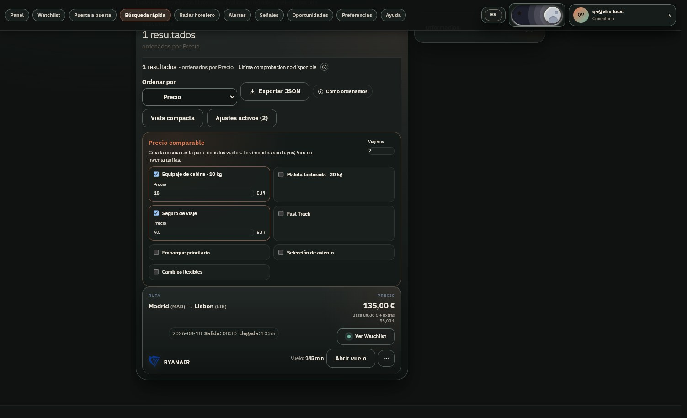
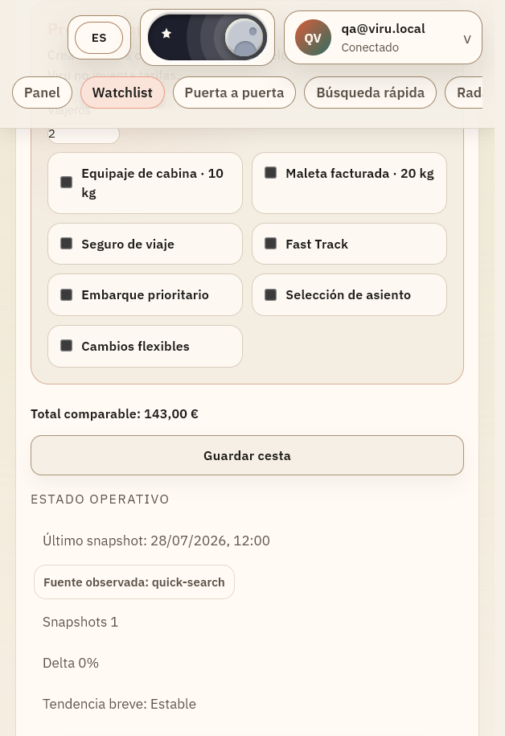

# QA manual — precio comparable

**Fecha:** 2026-07-28

**Rutas:** `/quick-search`, `/watchlist`

**Entorno:** build de producción local, Chromium controlado por navegador

**Resultado:** PASS

## Escenarios observados

1. En `/quick-search`, precio base de 80 EUR, dos viajeros, equipaje de cabina a 18 EUR y seguro a 9,50 EUR:
   - total comparable visible: 135 EUR;
   - desglose visible: base 80 EUR + extras 55 EUR.
2. Con un extra seleccionado sin importe:
   - el resultado conserva el precio base de 80 EUR;
   - aparece el aviso de importes pendientes;
   - no se presenta un total comparable completo.
3. Al guardar el resultado:
   - el `POST /api/v1/search/save-result` envía dos viajeros y los extras seleccionados;
   - `/watchlist` recupera la misma cesta y muestra 135 EUR.
4. En `/watchlist`, al añadir Fast Track a 4 EUR por persona y guardar:
   - el `PUT /api/v1/watchlist/{id}` conserva el perfil actualizado;
   - Fast Track permanece seleccionado tras la recarga;
   - el total comparable visible pasa a 143 EUR.

## Cobertura visual

- Escritorio, tema oscuro: jerarquía de cesta, inputs y total comprobada.
- Ventana móvil solicitada a 390 × 844, tema claro (viewport interno 502 × 732 por el mínimo del navegador): una columna, sin overflow horizontal.
- Consola: sin errores ni avisos de aplicación en la pasada final.

### Capturas

## Evidencia técnica relacionada

- cálculo unitario y estado incompleto;
- payload de guardado Quick Search → Watchlist;
- integración backend de creación, lectura y actualización de `fare_profile`;
- typecheck, build de producción y lint backend.
